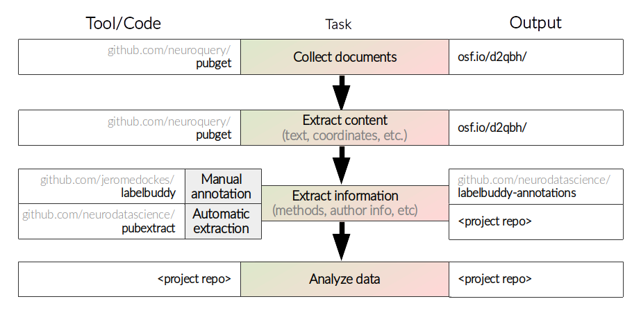

The neuroimaging literature is growing and it is flawed.
We need meta-research (including meta-analysis) to summarize the literature and to guide future research.

> “**Meta-research** is the study of research itself: its methods, reporting, reproducibility, evaluation, and incentives.” (Ioannidis, 2018)

There have been important meta-research papers in neuroimaging. For example:
- Eklund and colleagues [1] showed that certain implementations of cluster inference can result in false-positive rates over 50%
- Button and colleagues [2] showed that many studies are under-powered, and we need larger sample sizes in neuroscience to make valid inferences.

However, we cannot quantify how/whether the field has improved following such publications. 
This is because we cannot continually update such projects in order to monitor our progress. 
Thus, we need efficient, reproducible tools for doing meta-research in order to monitor progress in these areas. 

The field of meta-research is rapidly expanding as we have easier access to many papers (e.g., through PubMed).
However, the initial stages of meta-research can be challenging for the domain experts, who probably have the most interesting meta-research questions about their field.
<!-- These projects involve using APIs to collect documents, and then extracting the needed content from large amounts of text and metadata, in various formats. -->

There are some existing open collections of literature that may be used for meta-research (e.g., [3], [4]).
These datasets have been widely used (perhaps over-used); while useful, they are limited in that there is no mechanism in place to update them over time or to expand them across topics.
Further, they only share term frequencies, not the full texts, which limits which analyses can be done. 
Thus we need meta-research tools that are not only efficient and reproducible, but also user-friendly.

It is our goal to facilitate neuroimaging meta-research by providing these tools. 
In the figure below, we outline the main tasks involved in performing meta-research (middle column).
The left column of the figure shows the tools we have created to assist with these tasks, and the right column shows the locations we have created for storing and sharing the outputs of our tools, in order to make this research more standardized and reproducible. 
<!-- The last task, "Analyze data", is what most researchers are interested in doing. 
But the majority of time in these projects is spent on the previous steps, unless open datasets are used. -->

### References

[1] Eklund, A., Nichols, T. E., & Knutsson, H. (2016). Cluster failure: Why fMRI inferences for spatial extent have inflated false-positive rates. Proceedings of the national academy of sciences, 113(28), 7900-7905.

[2] Button, K. S., Ioannidis, J. P., Mokrysz, C., Nosek, B. A., Flint, J., Robinson, E. S., & Munafò, M. R. (2013). Power failure: why small sample size undermines the reliability of neuroscience. Nature reviews neuroscience, 14(5), 365-376.

[3] Yarkoni, T., Poldrack, R. A., Nichols, T. E., Van Essen, D. C., & Wager, T. D. (2011). Large-scale automated synthesis of human functional neuroimaging data. Nature methods, 8(8), 665-670.

[4] Dockès, J., Poldrack, R. A., Primet, R., Gözükan, H., Yarkoni, T., Suchanek, F., ... & Varoquaux, G. (2020). NeuroQuery, comprehensive meta-analysis of human brain mapping. Elife, 9, e53385.
